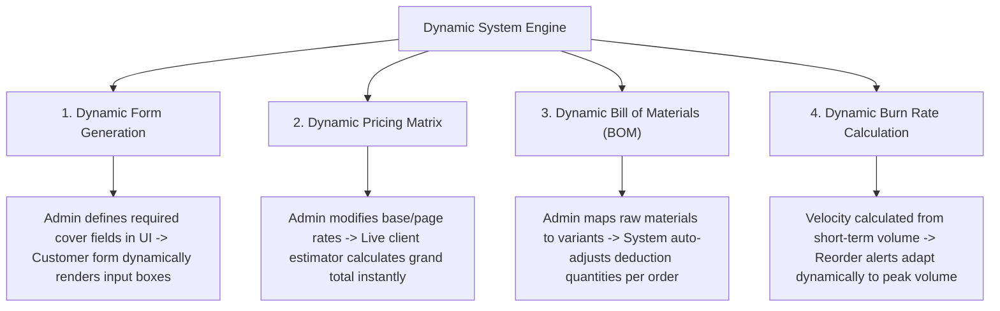
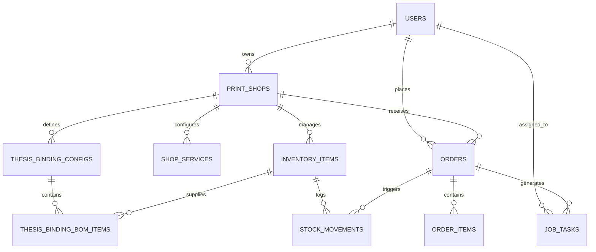
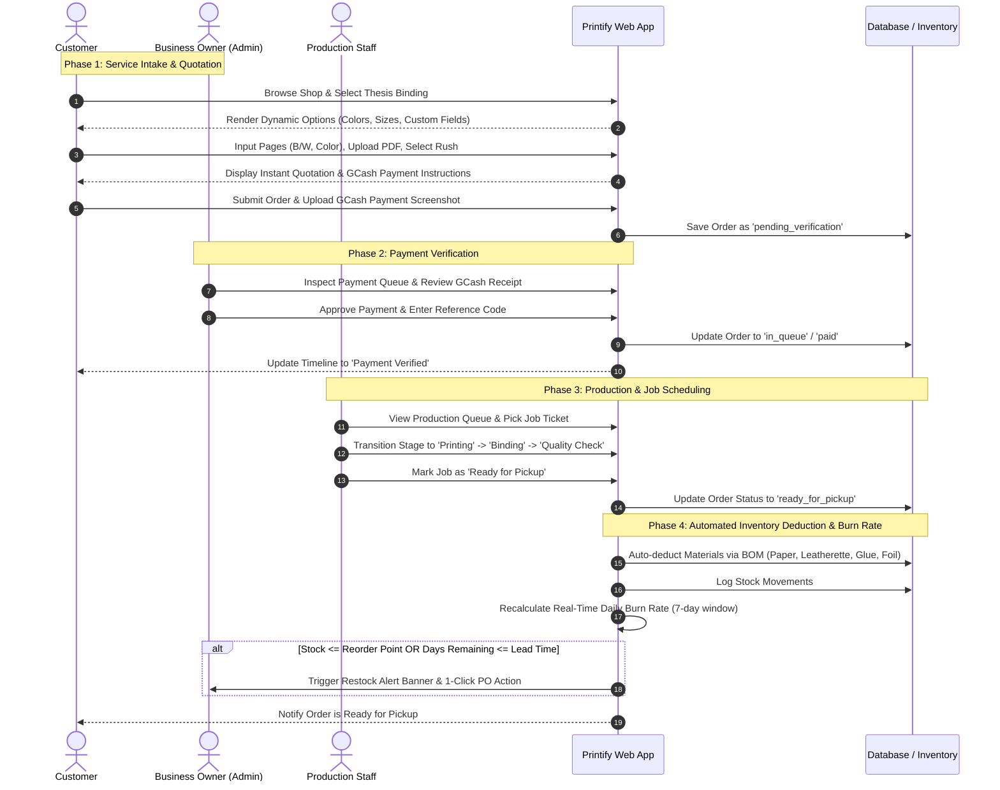

# Lean Product Requirements Document (PRD) & System Analysis and Design (SAD)

**Project Title:** Integrated Dynamic Order, Job Scheduling, and Inventory Management System for Printing Services with Automated Replenishment  
**Academic Program:** Bachelor of Science in Information Systems (BS IS)  
**Authors:** Kaye P. Comission & Christian James J. Perez  
**Target Delivery:** August 2026  
**Document Version:** 1.1 (Agile Architecture Update: Hybrid Relational-JSONB Schema & Dynamic Paradigm)

---

## 1. Executive Summary & Problem Context

### 1.1 Background & Problem Statement
Local commercial print and bindery shops play an indispensable role in serving educational institutions, MSMEs, and private individuals. However, these businesses experience severe operational gridlock during peak demand cycles (e.g., semester-end thesis submissions, local election campaigns, and corporate event seasons). Their current operational structure relies heavily on:
1. **Rigid, hardcoded software or manual record-keeping** that cannot adapt when shop owners introduce new services, variable page pricing formulas, or custom product variations.
2. **Physical paper job tickets** that get misplaced, improperly prioritized, or lost, creating communication breakdowns between front-desk staff and machine operators.
3. **Intuition-based inventory replenishment** where material stockouts (leatherette covers, chipboards, toner/ink, binding glue, foil stamping rolls) occur unexpectedly in the middle of active production runs.
4. **Opaque order progress** that compels anxious customers to repeatedly visit or call the shop to check if their orders are completed.

### 1.2 The Proposed Solution
This system is an **integrated, web-based operational platform** specifically engineered for printing and binding establishments. It modernizes the entire lifecycle of a print order through three interconnected architectural pillars:
1. **Dynamic Service & Pricing Architecture (Admin):** Allows business owners to configure, price, and customize printing services, variant attributes, and customer input fields without modifying backend source code.
2. **Digital Job Scheduling Queue (Production Staff):** Replaces paper job tickets with an interactive digital queue that tracks real-time progress across production stages, allocates workstations/machines, and enforces strict turnaround SLAs.
3. **Automated Inventory Replenishment via Real-Time Burn Rate (Inventory Engine):** Eliminates manual stock guesswork by computing short-term material consumption velocity (burn rate) from active order fulfillment and triggering data-driven alerts at calculated reorder thresholds.

---

## 2. Technology Stack & Architectural Paradigm

### 2.1 System Architecture Layering
```
+-----------------------------------------------------------------------------------+
|                                  PRESENTATION LAYER                               |
|   Tailwind CSS v4  |  Flux UI (Blade Components)  |  Alpine.js Reactive Directives|
+-----------------------------------------------------------------------------------+
|                                 APPLICATION LAYER                                 |
|               Laravel 13 Framework (PHP 8.5) + Livewire 4 Full-Page               |
|   - Dynamic Catalog Engine           - Production Dispatcher & Job Queue          |
|   - Real-Time Quotation Calculator   - Burn Rate & Reorder Point Engine           |
|   - Manual Payment Verification      - Storage & File Handling Service            |
+-----------------------------------------------------------------------------------+
|                                AUTHENTICATION LAYER                               |
|        Laravel Fortify: Session Auth, 2FA (TOTP/Recovery Codes), Passkeys        |
+-----------------------------------------------------------------------------------+
|                                    DATA LAYER                                     |
|                     HYBRID RELATIONAL + JSON/JSONB ARCHITECTURE                   |
|           SQLite (Local Development) / PostgreSQL / MySQL (Production)            |
+-----------------------------------------------------------------------------------+
```

### 2.2 Theoretical & Academic Justification of the "Dynamic" Paradigm
In Information Systems and Software Architecture, **"Dynamic"** is academically and formally defined as **Runtime Zero-Code Configurability**. It means that the system's operational parameters, UI forms, pricing rules, and inventory deduction formulas are evaluated dynamically at runtime from stored metadata, eliminating the need for software developers to rewrite controllers, views, or database migrations.



> **Oral Defense Script (Defense against Panel Questions):**  
> *"Traditional printing management systems are static and hardcoded—any new variant, price change, or custom input requirement demands code changes and manual database migrations. Our system implements a **Hybrid Relational + JSONB Dynamic Architecture**. Non-technical business owners can dynamically introduce new product variants, configure multi-tiered pricing matrices, and specify custom customer cover fields on the fly through the web UI with zero source code alterations."*

---

## 3. Core System Modules & Functional Design

### Module 1: Dynamic Order & Pricing Configuration Engine (Admin-Facing)
- **Dynamic Service Catalog:** Enables shop owners to activate pre-installed services (e.g., Web Builder, Thesis Binding) or configure additional modular printing offerings (Document Printing, Tarpaulin, T-Shirt Sublimation, PVC IDs, Stickers, Mugs).
- **Multi-Factor Pricing Matrix:** Configures base setup fees, tiered black-and-white page rates, colored page rates, rush delivery multipliers, and binding material surcharges.
- **Dynamic Variant Customizer:** Defines custom cover colors (e.g., Maroon, Dark Blue, Emerald Green, Black), hot foil stamping colors (Gold, Silver), and supported paper dimensions (A4, Letter, Legal).
- **Custom Form Field Builder:** Allows admins to define required client metadata fields (e.g., Thesis Title, Researcher Names, Degree/Program, Adviser Name, School Year) dynamically rendered on the customer ordering intake form.
- **Production Quota & Lead-Time Rules:** Establishes standard production lead times (e.g., 4 business days), rush lead times (e.g., 24–48 hours), and daily maximum production quotas (e.g., 20 hardbound copies/day) to prevent shop overloading.

### Module 2: Customer Ordering & Self-Service Intake Portal (Customer-Facing)
- **Interactive Price Quotation Calculator:** Real-time preview of total order cost dynamically calculated as the customer adjusts page counts (B/W vs Color), binding type (Hardbound vs Softbound), paper size, foil selection, and rush priority.
- **Service Fulfillment Modes (Full Package vs Cover-Only):**
  - *Full Package:* Full printing and binding of uploaded manuscript document.
  - *Cover & Binding Only ("Dala ang Papel"):* Customer supplies their own pre-printed, collated page block. System sets printing charges to ₱0.00, applies only the base hardbound cover fee, computes exact spine thickness ($\text{pages} \times 0.1\text{mm}$), retains foil stamping inputs and digital reference PDF upload, and generates walk-in counter intake instructions.
- **Digital Asset & Document Submission:** Secure upload of print-ready PDF files and thesis cover assets with client-side and server-side MIME-type validation.
- **Dynamic Metadata Form Input:** Customer fills out the custom fields defined by the shop admin for foil stamping and book spine layout.
- **Estimated Completion Date & Capacity Slot Reservation:** System provides a guaranteed completion date based on current daily quota availability and selected lead time.

### Module 3: Manual Payment Verification & Workflow Dispatcher
- **Domestic Payment Method Support:** Displays the shop's official payment channels (e.g., GCash QR code, GCash Account Name/Number, Maya, or In-Store Cash Deposit instructions).
- **Receipt Proof Submission:** Customer uploads a digital screenshot/photo of their payment transaction and inputs the reference number.
- **Admin Verification Queue:** Dedicated review dashboard for the business owner to inspect uploaded receipts, verify reference numbers against bank/e-wallet notifications, and approve or reject payments with feedback notes.
- **Automated Workflow Trigger:** Upon payment approval, the order is automatically stamped as `Paid` and dispatched into the active Production Staff Job Queue.

### Module 4: Digital Job Scheduling & Production Queue (Staff-Facing)
- **Visual Production Kanban / Queue Board:** Organizes active jobs into sequential production stages:
  $$\text{Pending Queue} \longrightarrow \text{Document Printing} \longrightarrow \text{Cover & Binding} \longrightarrow \text{Quality Check (QC)} \longrightarrow \text{Ready for Pickup / Delivered}$$
- **Physical Paper Intake Tracker:** 1-Click confirmation button for Cover-Only orders when student drops off physical printed sheets at the shop counter (`is_paper_received = true`).
- **Job Ticket Detail View:** Production staff can view exact customer specifications, download raw PDF files, review cover metadata, and inspect special printing instructions.
- **Task & Machine Allocation:** Allows assignment of specific staff members and equipment/workstations (e.g., Laser Printer 1, Heavy Duty Binding Press) to active jobs.
- **Visual Turnaround & SLA Monitoring:** Color-coded urgency indicators (Normal, Warning, Urgent/Rush) based on due date proximity.

### Module 5: Automated Inventory Replenishment & Real-Time Burn Rate Engine
- **Bill of Materials (BOM) Recipe Mapping:** Links each printing service variant to its constituent raw inventory items:
  - *Example (1 Hardbound Thesis - Full Package):* 1 pc Chipboard (2mm) + 1 sheet Leatherette Cover + $N$ sheets A4 80gsm Paper + 1 unit Binding Glue + 0.1 roll Stamping Foil.
  - *Example (1 Hardbound Thesis - Cover Only):* 1 pc Chipboard (2mm) + 1 sheet Leatherette Cover + 0 sheets Paper + 1 unit Binding Glue + 0.1 roll Stamping Foil.
- **Automated Material Deduction Trigger:** Upon advancing an order through production or marking it completed, the system automatically deducts corresponding material quantities from the digital inventory.
- **Real-Time Consumption Velocity (Burn Rate):** Computes material depletion speed over an active observation window (e.g., past 7 days) based on actual completed job volume:
  $$\text{Daily Burn Rate } (B_i) = \frac{\sum \text{Quantity of Material } i \text{ consumed in past } N \text{ days}}{N \text{ days}}$$
- **Dynamic Days-of-Stock Remaining ($D_i$):**
  $$D_i = \frac{\text{Current Stock Level } (S_i)}{\text{Daily Burn Rate } (B_i)}$$
- **Data-Driven Restock Alerts:** When $S_i \le \text{Reorder Level } (R_i)$ or $D_i \le \text{Supplier Lead Time}$, the system triggers high-visibility restock alert banners on the Admin Dashboard.
- **1-Click Purchase Order (PO) / Restock Summary Generator:** Generates a formatted replenishment summary listing item SKUs, required reorder quantities, and supplier details ready for export or communication.

### Module 6: Business Intelligence & Profitability Analytics
- **Estimated Material Cost vs Selling Price:** Uses BOM unit costs to calculate the exact material expense per order, revealing gross profit margins:
  $$\text{Gross Profit} = \text{Order Selling Price} - \text{Total BOM Material Cost}$$
- **Capacity & Bottleneck Tracking:** Displays daily machine utilization, staff task throughput, and peak order intake periods.

---

## 4. Database Architecture: Hybrid Relational + JSON/JSONB Design

### 4.1 Schema Strategy Rationale
To achieve maximum query performance, strict transactional integrity, and complete runtime flexibility, the system utilizes a **Hybrid Relational + JSON/JSONB Schema**:
1. **Relational Columns:** Used for transactional IDs, Foreign Keys, financial amounts, stock quantities, and timestamps. This enforces ACID compliance, fast indexing, and rigid audit logging.
2. **JSON / JSONB Columns:** Used for polymorphic configuration matrices (e.g. `cover_colors`, `foil_colors`, `custom_cover_fields`) and customer dynamic responses (`custom_fields_data`).



### 4.2 Comprehensive Table Specifications

#### 1. `users` (Existing & Enhanced)
| Column | Type | Description |
| :--- | :--- | :--- |
| `id` | BIGINT PK | Unique user identifier |
| `name` | VARCHAR(255) | Full name |
| `email` | VARCHAR(255) UNIQUE | User email address |
| `password` | VARCHAR(255) | Hashed password |
| `role` | VARCHAR(50) | `business_owner`, `production_staff`, `customer` |
| `avatar` | VARCHAR(255) NULL | Profile image path |
| `created_at`, `updated_at` | TIMESTAMP | Audit timestamps |

#### 2. `print_shops` (Existing)
| Column | Type | Description |
| :--- | :--- | :--- |
| `id` | BIGINT PK | Shop identifier |
| `user_id` | BIGINT FK -> users | Business owner account ID |
| `name` | VARCHAR(255) | Shop trading name |
| `is_setup_completed` | BOOLEAN | Onboarding wizard completion status |
| `created_at`, `updated_at` | TIMESTAMP | Audit timestamps |

#### 3. `inventory_items` (Existing)
| Column | Type | Description |
| :--- | :--- | :--- |
| `id` | BIGINT PK | Material item ID |
| `print_shop_id` | BIGINT FK -> print_shops | Parent print shop |
| `name` | VARCHAR(255) | Material name (e.g. Leatherette Cover Maroon) |
| `sku` | VARCHAR(100) NULL | Stock Keeping Unit code |
| `category` | VARCHAR(100) | `Raw Material`, `Paper`, `Adhesive`, `Foil`, `Consumable` |
| `stock_qty` | DECIMAL(12,2) | Current physical quantity on hand |
| `unit` | VARCHAR(50) | `pcs`, `sheets`, `kg`, `rolls`, `boxes` |
| `unit_cost` | DECIMAL(10,2) DEFAULT 0.00 | Cost per unit for profit calculation |
| `reorder_level` | DECIMAL(12,2) | Minimum safety threshold for alerts |
| `created_at`, `updated_at` | TIMESTAMP | Audit timestamps |

#### 4. `thesis_binding_configs` (Existing Dynamic Prototype)
| Column | Type | Description |
| :--- | :--- | :--- |
| `id` | BIGINT PK | Configuration record ID |
| `print_shop_id` | BIGINT FK -> print_shops | Associated shop |
| `is_active` | BOOLEAN | Module availability toggle |
| `hardbound_base_price` | DECIMAL(10,2) | Base price for hardbound compilation |
| `softbound_base_price` | DECIMAL(10,2) | Base price for softbound compilation |
| `allow_customer_supplied_paper` | BOOLEAN | Toggle for Cover-Only pre-printed paper mode |
| `hardbound_cover_only_price` | DECIMAL(10,2) | Base fee for cover-only hardbound binding |
| `page_price_bw` | DECIMAL(10,2) | Price per black & white printed page |
| `page_price_color` | DECIMAL(10,2) | Price per colored printed page |
| `rush_fee` | DECIMAL(10,2) | Additional fee for expedited processing |
| **`cover_colors`** | **JSON / JSONB** | Dynamic array of available cover colors |
| **`foil_colors`** | **JSON / JSONB** | Dynamic array of hot foil stamping colors |
| **`paper_sizes`** | **JSON / JSONB** | Dynamic array of supported paper sizes |
| `auto_deduct_inventory` | BOOLEAN | Auto-deduction toggle on job completion |
| `daily_production_quota` | INT | Maximum allowable book units per day |
| `standard_lead_time_days` | INT | Default turnaround in days |
| `rush_lead_time_days` | INT | Rush turnaround in days |
| `require_pdf_upload` | BOOLEAN | Enforce mandatory PDF file attachment |
| **`custom_cover_fields`** | **JSON / JSONB** | Dynamic list of required cover metadata inputs |
| `created_at`, `updated_at` | TIMESTAMP | Audit timestamps |

#### 5. `thesis_binding_bom_items` (Existing BOM Recipe)
| Column | Type | Description |
| :--- | :--- | :--- |
| `id` | BIGINT PK | BOM recipe item ID |
| `thesis_binding_config_id`| BIGINT FK | Parent thesis binding configuration |
| `inventory_item_id` | BIGINT FK -> inventory_items | Raw material consumed |
| `binding_type` | VARCHAR(50) | `hardbound`, `softbound`, or `both` |
| `usage_qty` | DECIMAL(10,2) | Quantity consumed per unit ordered |
| `unit` | VARCHAR(50) | Usage unit (e.g. `sheets`, `pcs`) |
| `created_at`, `updated_at` | TIMESTAMP | Audit timestamps |

#### 6. `orders` (Existing & Enhanced Table)
| Column | Type | Description |
| :--- | :--- | :--- |
| `id` | BIGINT PK | Order ID |
| `order_number` | VARCHAR(50) UNIQUE | Human-readable order code (e.g., `ORD-2026-0001`) |
| `print_shop_id` | BIGINT FK -> print_shops | Shop fulfilling the order |
| `customer_id` | BIGINT FK -> users | Customer account placing the order |
| `service_key` | VARCHAR(50) | `thesis_binding`, `document_printing`, etc. |
| `order_status` | VARCHAR(50) | `pending_payment`, `in_queue`, `in_production`, `ready_for_pickup`, `completed`, `cancelled` |
| `payment_status` | VARCHAR(50) | `unpaid`, `pending_verification`, `verified_paid`, `rejected` |
| `subtotal_amount` | DECIMAL(10,2) | Calculated service cost |
| `rush_fee_amount` | DECIMAL(10,2) | Applied rush charge (if selected) |
| `total_amount` | DECIMAL(10,2) | Final payable amount |
| `is_rush` | BOOLEAN | Rush order indicator flag |
| `target_completion_date`| DATE | Committed fulfillment deadline |
| `payment_proof_path` | VARCHAR(255) NULL | Path to uploaded GCash/payment screenshot |
| `payment_reference_no` | VARCHAR(100) NULL | Customer-entered transaction reference |
| `payment_verified_at` | TIMESTAMP NULL | Verification timestamp |
| `payment_verified_by` | BIGINT FK -> users NULL | Admin who approved payment |
| `assigned_staff_id` | BIGINT FK -> users NULL | Staff assigned to execute job |
| `assigned_machine` | VARCHAR(100) NULL | Machine/workstation assigned |
| `production_stage` | VARCHAR(50) | `queue`, `printing`, `binding`, `quality_check`, `ready_for_pickup`, `completed` |
| `production_started_at`| TIMESTAMP NULL | Start timestamp of physical work |
| `production_completed_at`| TIMESTAMP NULL| Completion timestamp |
| `staff_notes` | TEXT NULL | Internal operator comments or QA logs |
| `rejection_reason` | TEXT NULL | Admin feedback on rejected receipts |
| `created_at`, `updated_at` | TIMESTAMP | Audit timestamps |

#### 7. `order_items` (Existing & Enhanced Table)
| Column | Type | Description |
| :--- | :--- | :--- |
| `id` | BIGINT PK | Order line item ID |
| `order_id` | BIGINT FK -> orders | Parent order |
| `binding_type` | VARCHAR(50) | `hardbound`, `softbound`, `standard` |
| `fulfillment_type` | VARCHAR(50) | `full_package` (print & bind) or `cover_only` (customer supplied pages) |
| `is_paper_received` | BOOLEAN | Counter intake status for cover-only orders |
| `estimated_spine_thickness_mm` | DECIMAL(5,2) | Calculated spine thickness for chipboard sizing |
| `bw_pages_count` | INT | Number of black & white pages |
| `color_pages_count` | INT | Number of colored pages |
| `total_pages_count` | INT | Total page volume |
| `cover_color` | VARCHAR(100) NULL | Chosen cover color |
| `foil_color` | VARCHAR(100) NULL | Chosen foil stamping color |
| `paper_size` | VARCHAR(50) | Chosen paper size (`A4`, `Letter`, `Legal`) |
| `copies_count` | INT DEFAULT 1 | Number of book/item copies |
| **`custom_fields_data`** | **JSON / JSONB** | Customer responses to dynamic cover metadata fields |
| `selected_addons` | JSON / JSONB NULL | Attached retail accessory items |
| `document_file_path` | VARCHAR(255) NULL | Stored PDF file path |
| `document_original_name`| VARCHAR(255) NULL | Original uploaded filename |
| `unit_price` | DECIMAL(10,2) | Price per single copy |
| `total_price` | DECIMAL(10,2) | Total line item price |
| `created_at`, `updated_at` | TIMESTAMP | Audit timestamps |

#### 8. `job_tasks` (NEW Planned Table / Queue Tracker)
| Column | Type | Description |
| :--- | :--- | :--- |
| `id` | BIGINT PK | Production task ID |
| `order_id` | BIGINT FK -> orders | Linked customer order |
| `stage` | VARCHAR(50) | `printing`, `binding`, `qc_inspection`, `packaging`, `ready` |
| `assigned_staff_id` | BIGINT FK -> users NULL | Staff member executing task |
| `assigned_machine` | VARCHAR(100) NULL | Machine/workstation utilized |
| `started_at` | TIMESTAMP NULL | Production start timestamp |
| `completed_at` | TIMESTAMP NULL | Completion timestamp |
| `notes` | TEXT NULL | Production or QA notes |
| `created_at`, `updated_at` | TIMESTAMP | Audit timestamps |

#### 9. `stock_movements` (NEW Planned Table / Audit Trail)
| Column | Type | Description |
| :--- | :--- | :--- |
| `id` | BIGINT PK | Movement log ID |
| `inventory_item_id` | BIGINT FK -> inventory_items | Material affected |
| `order_id` | BIGINT FK -> orders NULL | Related order (if triggered by production) |
| `movement_type` | VARCHAR(50) | `production_deduction`, `manual_restock`, `adjustment_spoilage` |
| `quantity` | DECIMAL(12,2) | Amount deducted (-) or added (+) |
| `previous_stock` | DECIMAL(12,2) | Stock before movement |
| `resulting_stock` | DECIMAL(12,2) | Stock after movement |
| `logged_by` | BIGINT FK -> users | User who performed action |
| `created_at` | TIMESTAMP | Movement timestamp |

---

## 5. End-to-End Operational Workflow Diagram



---

## 6. Non-Functional Requirements & ISO 25010 Mapping

| ISO 25010 Quality Metric | System Specification & Implementation Standard |
| :--- | :--- |
| **1. Functional Suitability** | Complete coverage of dynamic pricing, file uploads, manual GCash verification, stage transitions, and deterministic BOM inventory deductions. |
| **2. Usability & UX** | High-contrast Dark Stone / Amber theme, instant live price previews, zero-clutter single-page forms, responsive mobile & desktop views with Flux UI and Tailwind CSS v4. |
| **3. Performance Efficiency** | Sub-second page interactions with Livewire 4 reactive components; real-time burn rate math executed in optimized database aggregation queries without blocking web workers. |
| **4. Security & Integrity** | Fortify multi-factor authentication (2FA + WebAuthn Passkeys), role-based middleware guards (`isOwner`, `isStaff`, `isCustomer`), strict PDF file MIME-type inspection, and CSRF token protection. |

---

## 7. Scope Boundaries & Explicit Limitations

To maintain high academic defensibility and avoid unnecessary architectural complexity:
- **No Third-Party Bank API / Automated Payment Gateway:** Relying on manual receipt verification (e.g., GCash upload) directly reflects Philippine MSME operations and eliminates merchant API fee barriers.
- **No ERP Bloat:** Comprehensive financial ledger accounting, HR/payroll, and employee biometric timekeeping are strictly excluded.
- **No Direct IoT / Machine Hardware Readers:** System does not interface with printer hardware counters or physical ink sensors; all material consumption is digitally derived from confirmed BOM job executions.
