# UML Class Diagram: Printify Management Platform

**Project Title:** Integrated Dynamic Order, Job Scheduling, and Inventory Management System for Printing Services with Automated Replenishment  
**Diagram Type:** UML 2.5 Class Diagram (Structural Model)  
**Modeling Scope:** User Specialization Hierarchy, Multi-Tenant Print Shop Core, Order Management & Production Pipelines, and Automated Bill of Materials (BOM) Inventory Telemetry  

---

## 1. Visual Class Diagram (Mermaid.js)

```mermaid
classDiagram
    direction LR

    %% ==========================================
    %% USER INHERITANCE HIERARCHY
    %% ==========================================
    class User {
        -int id
        -String name
        -String email
        -String password
        -String role
        -String contactNumber
        -String avatar
        -boolean twoFactorEnabled
        -DateTime createdAt
        +isOwner() boolean
        +isStaff() boolean
        +isCustomer() boolean
        +hasRole(role: String) boolean
        +avatarUrl() String
    }

    class BusinessOwner {
        -String taxIdentificationNumber
        -String businessPermitNo
        +setupShop(name: String) PrintShop
        +configureService(key: String, settings: JSON) boolean
        +defineBomRecipe(itemId: int, qty: float) ServiceBom
        +viewFinancialAnalytics() Report
    }

    class ProductionStaff {
        -String employeeId
        -String assignedWorkstation
        +verifyPayment(orderId: int, status: String) boolean
        +advanceProductionStage(orderId: int) void
        +verifyCustomerSubstrate(orderId: int) boolean
        +recordSpoilageWaste(itemId: int, qty: float) StockMovement
    }

    class Customer {
        -String customerType
        -String institutionName
        +browseCatalog() List~ShopService~
        +calculateQuotation(specs: JSON) float
        +placeOrder(items: List~OrderItem~) Order
        +submitPaymentProof(orderId: int, path: String) boolean
        +trackOrder(orderNumber: String) OrderStatus
    }

    %% ==========================================
    %% ENTERPRISE & CATALOG CORE
    %% ==========================================
    class PrintShop {
        -int id
        -int userId
        -String name
        -String contactNumber
        -String address
        -boolean isSetupCompleted
        -DateTime createdAt
        +hasService(serviceKey: String) boolean
        +getActiveServices() List~ShopService~
        +getLowStockAlerts() List~InventoryItem~
    }

    class ShopService {
        -int id
        -int printShopId
        -String serviceKey
        -String serviceName
        -boolean isActive
        -int displayOrder
        -JSON settings
        -DateTime createdAt
        +getSetting(key: String, default: mixed) mixed
        +updateSetting(key: String, value: mixed) void
        +calculatePrice(specs: JSON) float
    }

    class ServiceBom {
        -int id
        -int printShopId
        -String serviceKey
        -int inventoryItemId
        -String componentName
        -String usageType
        -float usageQty
        -String unit
        -JSON conditions
        +evaluateConditions(specs: JSON) boolean
        +calculateDeduction(pages: int, copies: int) float
    }

    %% ==========================================
    %% INVENTORY & AUDIT TELEMETRY
    %% ==========================================
    class InventoryItem {
        -int id
        -int printShopId
        -String name
        -String sku
        -String category
        -String itemType
        -float stockQty
        -String unit
        -float reorderLevel
        -float unitCost
        -float sellingPrice
        -String supplierName
        +isLowStock() boolean
        +isOutOfStock() boolean
        +stockStatus() String
        +deductStock(qty: float) void
        +restock(qty: float) void
    }

    class StockMovement {
        -int id
        -int inventoryItemId
        -int orderId
        -int loggedBy
        -String movementType
        -float quantity
        -float previousStock
        -float resultingStock
        -String referenceNote
        -DateTime createdAt
        +recordMovement() void
        +getAuditSummary() String
    }

    %% ==========================================
    %% ORDERING & PRODUCTION PIPELINE
    %% ==========================================
    class Order {
        -int id
        -String orderNumber
        -int printShopId
        -int customerId
        -int assignedStaffId
        -String serviceKey
        -String orderStatus
        -String paymentStatus
        -String productionStage
        -float subtotalAmount
        -float rushFeeAmount
        -float totalAmount
        -boolean isRush
        -String paymentProofPath
        -String paymentReferenceNo
        -DateTime targetCompletionDate
        +generateOrderNumber() String
        +isPaperIntakePending() boolean
        +advanceStage(staffId: int, machine: String) void
        +stepBackStage(reason: String) void
        +verifyPayment(staffId: int) void
    }

    class OrderItem {
        -int id
        -int orderId
        -String bindingType
        -String fulfillmentType
        -boolean isPaperReceived
        -int bwPagesCount
        -int colorPagesCount
        -int totalPagesCount
        -int copiesCount
        -String paperSize
        -JSON specifications
        -String documentFilePath
        -float unitPrice
        -float totalPrice
        +isCoverOnly() boolean
        +isFullPackage() boolean
        +isDuplex() boolean
        +getPhysicalSheetsCount() int
        +calculateItemTotal() float
    }

    %% ==========================================
    %% STRUCTURAL RELATIONSHIPS & MULTIPLICITIES
    %% ==========================================
    %% Inheritance (Generalization)
    User <|-- BusinessOwner
    User <|-- ProductionStaff
    User <|-- Customer

    %% Shop Associations
    BusinessOwner "1" --> "1" PrintShop : owns
    PrintShop "1" *-- "1..*" ShopService : manages
    PrintShop "1" o-- "0..*" InventoryItem : stocks

    %% Catalog & Recipe Relationships
    ShopService "1" *-- "0..*" ServiceBom : defines
    ServiceBom "0..*" --> "1" InventoryItem : consumes

    %% Transactional & Production Relationships
    Customer "1" --> "0..*" Order : places
    PrintShop "1" --> "0..*" Order : receives
    ProductionStaff "0..1" --> "0..*" Order : processes
    Order "1" *-- "1..*" OrderItem : contains

    %% Inventory Ledger Relationships
    InventoryItem "1" *-- "0..*" StockMovement : tracks
    Order "0..1" --> "0..*" StockMovement : triggers
    User "1" --> "0..*" StockMovement : records
```



---

## 2. Markdown Fallback Blueprint (Draw.io / Lucidchart Guide)

Gamitin itong detalyadong breakdown upang madali mong mai-plot ang mga 3-compartment class boxes sa Draw.io o Lucidchart.

### A. Class Specifications (Attributes & Operations)

#### 1. `User` (General Superclass)
* **Stereotype:** `<<entity>>`
* **Attributes:**
  - `- id: int`
  - `- name: String`
  - `- email: String`
  - `- password: String`
  - `- role: String`
  - `- contactNumber: String`
  - `- avatar: String`
  - `- twoFactorEnabled: boolean`
  - `- createdAt: DateTime`
* **Methods:**
  - `+ isOwner(): boolean`
  - `+ isStaff(): boolean`
  - `+ isCustomer(): boolean`
  - `+ hasRole(role: String): boolean`
  - `+ avatarUrl(): String`

#### 2. `BusinessOwner` (Specialized User Subclass)
* **Stereotype:** `<<subclass>>` (Inherits from `User`)
* **Attributes:**
  - `- taxIdentificationNumber: String`
  - `- businessPermitNo: String`
* **Methods:**
  - `+ setupShop(name: String): PrintShop`
  - `+ configureService(key: String, settings: JSON): boolean`
  - `+ defineBomRecipe(itemId: int, qty: float): ServiceBom`
  - `+ viewFinancialAnalytics(): Report`

#### 3. `ProductionStaff` (Specialized User Subclass)
* **Stereotype:** `<<subclass>>` (Inherits from `User`)
* **Attributes:**
  - `- employeeId: String`
  - `- assignedWorkstation: String`
* **Methods:**
  - `+ verifyPayment(orderId: int, status: String): boolean`
  - `+ advanceProductionStage(orderId: int): void`
  - `+ verifyCustomerSubstrate(orderId: int): boolean`
  - `+ recordSpoilageWaste(itemId: int, qty: float): StockMovement`

#### 4. `Customer` (Specialized User Subclass)
* **Stereotype:** `<<subclass>>` (Inherits from `User`)
* **Attributes:**
  - `- customerType: String`
  - `- institutionName: String`
* **Methods:**
  - `+ browseCatalog(): List<ShopService>`
  - `+ calculateQuotation(specs: JSON): float`
  - `+ placeOrder(items: List<OrderItem>): Order`
  - `+ submitPaymentProof(orderId: int, path: String): boolean`
  - `+ trackOrder(orderNumber: String): OrderStatus`

#### 5. `PrintShop` (Tenant Root Entity)
* **Stereotype:** `<<aggregate root>>`
* **Attributes:**
  - `- id: int`
  - `- userId: int`
  - `- name: String`
  - `- contactNumber: String`
  - `- address: String`
  - `- isSetupCompleted: boolean`
  - `- createdAt: DateTime`
* **Methods:**
  - `+ hasService(serviceKey: String): boolean`
  - `+ getActiveServices(): List<ShopService>`
  - `+ getLowStockAlerts(): List<InventoryItem>`

#### 6. `ShopService` (Service Catalog Entity)
* **Stereotype:** `<<entity>>`
* **Attributes:**
  - `- id: int`
  - `- printShopId: int`
  - `- serviceKey: String`
  - `- serviceName: String`
  - `- isActive: boolean`
  - `- displayOrder: int`
  - `- settings: JSON`
  - `- createdAt: DateTime`
* **Methods:**
  - `+ getSetting(key: String, default: mixed): mixed`
  - `+ updateSetting(key: String, value: mixed): void`
  - `+ calculatePrice(specs: JSON): float`

#### 7. `ServiceBom` (Bill of Materials Entity)
* **Stereotype:** `<<entity>>`
* **Attributes:**
  - `- id: int`
  - `- printShopId: int`
  - `- serviceKey: String`
  - `- inventoryItemId: int`
  - `- componentName: String`
  - `- usageType: String`
  - `- usageQty: float`
  - `- unit: String`
  - `- conditions: JSON`
* **Methods:**
  - `+ evaluateConditions(specs: JSON): boolean`
  - `+ calculateDeduction(pages: int, copies: int): float`

#### 8. `InventoryItem` (Supply Asset Entity)
* **Stereotype:** `<<entity>>`
* **Attributes:**
  - `- id: int`
  - `- printShopId: int`
  - `- name: String`
  - `- sku: String`
  - `- category: String`
  - `- itemType: String`
  - `- stockQty: float`
  - `- unit: String`
  - `- reorderLevel: float`
  - `- unitCost: float`
  - `- sellingPrice: float`
  - `- supplierName: String`
* **Methods:**
  - `+ isLowStock(): boolean`
  - `+ isOutOfStock(): boolean`
  - `+ stockStatus(): String`
  - `+ deductStock(qty: float): void`
  - `+ restock(qty: float): void`

#### 9. `StockMovement` (Audit Ledger Entity)
* **Stereotype:** `<<immutable ledger>>`
* **Attributes:**
  - `- id: int`
  - `- inventoryItemId: int`
  - `- orderId: int`
  - `- loggedBy: int`
  - `- movementType: String`
  - `- quantity: float`
  - `- previousStock: float`
  - `- resultingStock: float`
  - `- referenceNote: String`
  - `- createdAt: DateTime`
* **Methods:**
  - `+ recordMovement(): void`
  - `+ getAuditSummary(): String`

#### 10. `Order` (Transaction Pipeline Entity)
* **Stereotype:** `<<aggregate root>>`
* **Attributes:**
  - `- id: int`
  - `- orderNumber: String`
  - `- printShopId: int`
  - `- customerId: int`
  - `- assignedStaffId: int`
  - `- serviceKey: String`
  - `- orderStatus: String`
  - `- paymentStatus: String`
  - `- productionStage: String`
  - `- subtotalAmount: float`
  - `- rushFeeAmount: float`
  - `- totalAmount: float`
  - `- isRush: boolean`
  - `- paymentProofPath: String`
  - `- paymentReferenceNo: String`
  - `- targetCompletionDate: DateTime`
* **Methods:**
  - `+ generateOrderNumber(): String`
  - `+ isPaperIntakePending(): boolean`
  - `+ advanceStage(staffId: int, machine: String): void`
  - `+ stepBackStage(reason: String): void`
  - `+ verifyPayment(staffId: int): void`

#### 11. `OrderItem` (Line Item Entity)
* **Stereotype:** `<<entity>>`
* **Attributes:**
  - `- id: int`
  - `- orderId: int`
  - `- bindingType: String`
  - `- fulfillmentType: String`
  - `- isPaperReceived: boolean`
  - `- bwPagesCount: int`
  - `- colorPagesCount: int`
  - `- totalPagesCount: int`
  - `- copiesCount: int`
  - `- paperSize: String`
  - `- specifications: JSON`
  - `- documentFilePath: String`
  - `- unitPrice: float`
  - `- totalPrice: float`
* **Methods:**
  - `+ isCoverOnly(): boolean`
  - `+ isFullPackage(): boolean`
  - `+ isDuplex(): boolean`
  - `+ getPhysicalSheetsCount(): int`
  - `+ calculateItemTotal(): float`

---

### B. Complete Relationship & Multiplicity Matrix

| Source Class | Target Class | UML Relationship Type | Symbol in Draw.io | Multiplicity | Verb Label | Rationale / Rule |
| :--- | :--- | :--- | :---: | :---: | :--- | :--- |
| **BusinessOwner** | **User** | Generalization (Inheritance) | `—▷` (Hollow Triangle) | N/A | *is a* | BusinessOwner inherits shared user credentials and base authentication. |
| **ProductionStaff**| **User** | Generalization (Inheritance) | `—▷` (Hollow Triangle) | N/A | *is a* | ProductionStaff inherits shared user credentials and base authentication. |
| **Customer** | **User** | Generalization (Inheritance) | `—▷` (Hollow Triangle) | N/A | *is a* | Customer inherits shared user credentials and base authentication. |
| **BusinessOwner** | **PrintShop** | Association | `——>` (Directed Line) | `1` to `1` | *owns* | Strict 1:1 business ownership constraint. |
| **PrintShop** | **ShopService** | Composition | `◆——` (Filled Diamond at Shop) | `1` to `1..*` | *manages* | Services belong strictly to a shop; deleting a shop removes its service catalog. |
| **PrintShop** | **InventoryItem** | Aggregation | `◇——` (Hollow Diamond at Shop)| `1` to `0..*` | *stocks* | Inventory assets are owned and tracked by the print shop. |
| **ShopService** | **ServiceBom** | Composition | `◆——` (Filled Diamond at Service)| `1` to `0..*`| *defines* | BOM consumption recipes are integral definitions of dynamic services. |
| **ServiceBom** | **InventoryItem** | Association | `——>` (Directed Line) | `0..*` to `1` | *consumes* | BOM recipes reference and deduct specific physical inventory items. |
| **Customer** | **Order** | Association | `——>` (Directed Line) | `1` to `0..*` | *places* | Customers initiate and track digital print orders. |
| **PrintShop** | **Order** | Association | `——>` (Directed Line) | `1` to `0..*` | *receives* | Orders are fulfilled under a specific shop tenant instance. |
| **ProductionStaff**| **Order** | Association | `——>` (Directed Line) | `0..1` to `0..*`| *processes*| Workshop operator is assigned to supervise job stages. |
| **Order** | **OrderItem** | Composition | `◆——` (Filled Diamond at Order) | `1` to `1..*` | *contains* | An order cannot exist without line items; line items die if the order is deleted. |
| **InventoryItem** | **StockMovement** | Composition | `◆——` (Filled Diamond at Item) | `1` to `0..*` | *tracks* | Immutable ledger entries permanently belong to an inventory asset. |
| **Order** | **StockMovement** | Association | `——>` (Directed Line) | `0..1` to `0..*`| *triggers*| Order production deductions generate traceable stock movement audit entries. |
| **User** | **StockMovement** | Association | `——>` (Directed Line) | `1` to `0..*` | *records* | Every stock adjustment tracks the authenticated user who initiated it. |

---

### C. Zero-Crossing Draw.io Layout Guide (3-Column Architecture)

Para maging 100% zero-crossing ang linya sa iyong Draw.io / Lucidchart canvas, sundin itong 3-column placement grid:

```
┌─────────────────────────────────┐   ┌─────────────────────────────────┐   ┌─────────────────────────────────┐
│     LEFT COLUMN: USER ACTORS    │   │  CENTER COLUMN: ORDERS & SHOP   │   │ RIGHT COLUMN: SERVICES & STOCKS │
├─────────────────────────────────┤   ├─────────────────────────────────┤   ├─────────────────────────────────┤
│                                 │   │                                 │   │                                 │
│  [ BusinessOwner ] ─────────────┼───┼──> [ PrintShop ] ───────────────┼───┼──> [ ShopService ]              │
│         ▲                       │   │          │                      │   │          │                      │
│         │ (inherits)            │   │          │                      │   │          ▼ (composition)        │
│    [ User ] (Superclass)        │   │          │                      │   │    [ ServiceBom ]               │
│         │                       │   │          │                      │   │          │                      │
│    ┌────┴──────────────┐        │   │          ▼                      │   │          ▼ (consumes)           │
│    │                   │        │   │                                 │   │                                 │
│ [ ProductionStaff ]    │        │   │          │                      │   │    [ InventoryItem ]            │
│    │                   ▼        │   │          │                      │   │          │                      │
│    │             [ Customer ] ──┼───┼──> [ Order ]                    │   │          ▼ (composition)        │
│    │                            │   │       │     │                   │   │                                 │
│    │ (assigned to)              │   │       │     └── (triggers) ─────┼───┼──> [ StockMovement ]            │
│    └────────────────────────────┼───┼───────┘                         │   │                                 │
│                                 │   │       ▼ (composition)           │   │                                 │
│                                 │   │    [ OrderItem ]                │   │                                 │
│                                 │   │                                 │   │                                 │
└─────────────────────────────────┘   └─────────────────────────────────┘   └─────────────────────────────────┘
```

1. **Left Column (User Hierarchy):**
   - Ilagay ang `User` sa bandang gitna-kaliwa.
   - Si `BusinessOwner` sa itaas-kaliwa (`User <|-- BusinessOwner`).
   - Si `ProductionStaff` sa ibaba-kaliwa (`User <|-- ProductionStaff`).
   - Si `Customer` sa pinakababang bahagi ng kaliwa (`User <|-- Customer`).
2. **Center Column (Core Shop & Transactions):**
   - Si `PrintShop` sa itaas-gitna (katapat ni `BusinessOwner` para horizontal straight line).
   - Si `Order` sa gitna (katapat ni `Customer` para horizontal straight line).
   - Si `OrderItem` sa ilalim ni `Order` na may solid diamond composition (`Order ◆— OrderItem`).
3. **Right Column (Catalog & Inventory Telemetry):**
   - Si `ShopService` sa itaas-kanan (katapat ni `PrintShop`).
   - Si `ServiceBom` sa ilalim ni `ShopService` (`ShopService ◆— ServiceBom`).
   - Si `InventoryItem` sa ibaba ni `ServiceBom` (`ServiceBom ——> InventoryItem`).
   - Si `StockMovement` sa pinaka-ibaba (`InventoryItem ◆— StockMovement`).
   - Ang trigger line mula `Order` papuntang `StockMovement` ay dadaan nang direkta sa ibaba nang walang binabagtas na linya!
