# Figure 1. Conceptual Framework & Architectural Guide
### Integrated Dynamic Order, Job Scheduling, and Inventory Management System for Printing Services with Automated Replenishment

---

## I. Introduksyon (Introduction)

Ang **Conceptual Framework** (Figure 1) ay ang nagsisilbing theoretical at operational blueprint ng ating pag-aaral at system development. Ipinapakita nito ang lohikal na daloy kung paano pumasok ang impormasyon at materyales, paano ito pinoproseso ng web platform, ano ang mga konkretong functional outputs, at paano ito nagdudulot ng agarang operational outcomes at pangmatagalang business impact.

Batay sa institutional standard ng **University of Southern Mindanao (USM)** para sa Bachelor of Science in Information Systems (alinsunod sa mga naaprubahang outline tulad nina *Nonakan* at *Comission*), ang conceptual framework para sa mga application-driven capstone projects ay gumagamit ng pinalawak na **Input - Process - Output - Outcome - Impact (IPO-OI)** model na may **Feedback Loop**.

Ang framework na ito ay direktang nakadisenyo para sa ating sistema (**Printify**) at 100% naka-align sa mga itinama at iminungkahi ng panel (nina Ma’am Betg at Sir Ryan) noong nakaraang Title Defense.

---

## II. Visual Diagram (Flowchart)

Maaari mong makita ang visual structure sa ibaba gamit ang Mermaid render, o gamitin ang kaakibat na Draw.io script para sa official document formatting:

```mermaid
flowchart TD
    subgraph Core System IPO Flow
        direction TB
        
        subgraph INPUT ["1. INPUT (Mga Datos, Papel, at Materyales)"]
            direction TB
            I1["<b>Stakeholder Roles & Profiles:</b><br>• Business Owners, Production Staff, at Customer Accounts<br><br><b>Modular Service Parameters & Substrates:</b><br>• Dynamic Pricing Formulas (Page/SqFt/Unit) & Media Sizes (Short, A4, Long)<br>• Paper Thickness (70, 80, 100 gsm) & Substrates (Book Paper, Vinyl, Garment, PVC)<br>• Finishing Rules (Thermal Foil Stamping, Ring Binding, Eyelets, Sublimation)<br><br><b>Customer Digital Assets & Payment Proofs:</b><br>• PDF Manuscripts, Vector Artwork Files, at Customization Instructions<br>• GCash / Maya Transaction Slips & Cash Counter Verification Proofs<br><br><b>Raw Consumables & Multi-Tier Bill of Materials (BOM):</b><br>• Paper Reams, Vinyl Rolls, Inks/Toners, Chipboards, Ring Spines, PVC Blanks<br>• Baseline Stock Quantities, Supplier Lead Times, at Safety Buffers"]
        end

        subgraph PROCESS ["2. PROCESS (Lohika, Scheduling, at Automation)"]
            direction TB
            P1["<b>Order Intake & Dynamic Quotation Engine:</b><br>• Instant multi-attribute cost computation batay sa admin configuration<br>• Duplex discounts, rush order surcharges, at finishing add-ons calculation<br>• Manual payment verification & automated job state transition<br><br><b>Workshop Floor Scheduling & Production Routing:</b><br>• Digital 5-Stage Kanban Queueing (Queue → Printing → Assembly → QC → Ready)<br>• Customer-supplied paper tracking ('Dala ang Papel' & Client Garments)<br>• Workshop machine at operator task allocation<br><br><b>Automated Inventory & Telemetry Engine:</b><br>• Stage-based Bill of Materials (BOM) stock decrementing<br>• Daily consumption velocity ('Burn Rate') calculation across 7-day & 30-day horizons<br>• Dynamic Reorder Point (ROP) threshold evaluation & automated restock alerts<br><br><b>Operational & Financial Business Intelligence:</b><br>• Real-time aggregation ng gross sales, profit margins, at product mix volume"]
        end

        subgraph OUTPUT ["3. OUTPUT (Mga Functional Deliverables ng System)"]
            direction TB
            O1["<b>Integrated Web-to-Print Management Platform:</b><br>• Role-segregated, secured web portals para sa Owner, Staff, at Customer<br><br><b>Customer Storefront & Experience:</b><br>• Multi-service interactive ordering wizards & live 5-stage progress stepper<br><br><b>Production Floor Management Hub:</b><br>• Digital job tickets, machine queue dashboard, at floor Kanban console<br><br><b>Automated Inventory Telemetry & Replenishment:</b><br>• Restocking warning notifications, real-time stock balances, at movement audit logs<br><br><b>Business & Financial Intelligence:</b><br>• Multi-service revenue analytics, product mix breakdown, at exportable reports"]
        end

        INPUT -->|Feeds operational data into| PROCESS
        PROCESS -->|Generates functional deliverables| OUTPUT
    end

    subgraph OUTCOME ["4. OUTCOME (Agarang Operational Gains)"]
        direction TB
        OC1["• <b>Error-Free Multi-Product Intake:</b> Nawawala ang manual computation errors at counter congestion sa lahat ng serbisyo.<br>• <b>Organized Workshop Floor:</b> Ganap na pagkawala ng nawawalang paper job tickets at production floor mix-ups.<br>• <b>24/7 Client Transparency:</b> Tuloy-tuloy na self-service tracking na nag-aalis sa paulit-ulit na tawag at bisita.<br>• <b>Zero Stockout Halts:</b> Pag-iwas sa biglaang pagkaubos ng supplies tuwing peak graduation at election rush.<br>• <b>Data-Driven Procurement:</b> Pagpapalit sa intuitive hula-hula ng stock gamit ang totoong sales burn-rate velocity."]
    end

    subgraph IMPACT ["5. IMPACT (Pangmatagalang Kontribusyon at Benepisyo)"]
        direction TB
        IMP1["• <b>Enterprise Productivity & Profitability:</b> Pinakamataas na operational throughput, zero material waste, at mas mataas na kita para sa printing MSMEs.<br>• <b>Heightened Market Trust:</b> Mas matibay na tiwala ng mga estudyante at negosyo dahil sa laging on-time delivery.<br>• <b>Code-Free Business Adaptability:</b> Kakayahan ng may-ari ng shop na magdagdag ng bagong printing service nang hindi nagbabayad sa programmer.<br>• <b>Information Systems Benchmark:</b> Isang matatag na academic IS reference para sa job-shop business automation."]
    end

    OUTPUT -->|Delivers immediate operational gains| OUTCOME
    OUTCOME -->|Achieves long-term strategic goals| IMPACT
    OUTCOME -.->|Continuous System Refinement & Stock Synchronization| INPUT
```



---

## III. Detailed Explanation of Which is Which (Paliwanag sa Bawat Bahagi)

Upang lubos mong maipagtanggol at maipaliwanag ang bawat kahon sa panel o sa manuscript, narito ang detalyadong koneksyon nito sa ating system:

### 1. INPUT (Ano ang mga kailangan ng system bago gumana?)
* **Stakeholder Profiles:** Ang mga tatlong pangunahing user ng system:
  - *Business Owners:* Nagtatakda ng mga presyo, serbisyo, at nag-aapruba ng bayad.
  - *Production Staff:* Tumatanggap ng trabaho sa workshop floor at nag-a-update ng progress.
  - *Customers:* Mag-o-order online, mag-a-upload ng PDF o layout, at magmo-monitor ng status.
* **Modular Service Parameters & Substrates:** Ang mga dynamic configuration settings na ini-input ng may-ari (hal. presyo kada pahina ng B&W o Color, sukat ng papel tulad ng Short, A4, Long, kapal ng papel tulad ng 70gsm, 80gsm, 100gsm, at mga finishing options tulad ng hardbound stamping, ring binding, o tarpaulin eyelets). Hindi ito hardcoded sa database; binabago ito sa admin panel.
* **Customer Digital Assets & Payment Proofs:** Ang mismong PDF manuscripts ng mga estudyante, artwork files ng mga tarpaulin/sticker, at ang screenshot receipt ng GCash/Maya reference number.
* **Raw Consumables & Multi-Tier Bill of Materials (BOM):** Ang baseline inventory ng shop tulad ng ream ng papel, bote ng tinta, ring spines, chipboard para sa hardbound, at safety stock thresholds.

---

### 2. PROCESS (Ano ang ginagawa ng system sa loob?)
* **Order Intake & Dynamic Quotation Engine:** Sa pagpili pa lamang ng customer, awtomatikong kinukwenta ng system ang kabuuang presyo batay sa formula (hal. `(Number of Pages × Page Rate) + Binding Fee + Paper Fee - Duplex Discount + Rush Fee`). Pagkatapos mag-upload ng resibo, vinerify ito ng staff bago pumasok sa paggawa.
* **Workshop Floor Scheduling & Production Routing:** Ito ang direktang sagot sa puna ng panel tungkol sa *Job Scheduling*. Ang bawat order ay pumapasok sa isang digital 5-Stage Kanban Queue:
  $$\text{Queue} \longrightarrow \text{Printing} \longrightarrow \text{Assembly/Binding} \longrightarrow \text{Quality Check} \longrightarrow \text{Ready for Pickup}$$
  Sinusubaybayan din dito kung ang customer ay nagdala ng sariling papel (*"Dala ang Papel"* feature) upang ibawas ang paper fee at hindi magbawas sa stock ng shop.
* **Automated Inventory & Telemetry Engine:** Sa bawat paglipat ng order sa mga production stage, awtomatikong binabawas ng system ang materyales gamit ang Bill of Materials (BOM). Kinakalkula nito ang **Burn Rate** (bilang ng nagamit na materyales kada araw sa loob ng 7 at 30 araw) at nagko-compute ng dynamic **Reorder Point (ROP)**:
  $$\text{ROP} = (\text{Daily Burn Rate} \times \text{Supplier Lead Time}) + \text{Safety Buffer}$$
* **Operational & Financial Business Intelligence:** Awtomatikong pinagsasama-sama ang benta, kita, at product mix ratio upang makita ng owner kung aling serbisyo ang pinakamalakas.

---

### 3. OUTPUT (Ano ang mga kongkretong resulta na lumalabas sa system?)
* **Integrated Web-to-Print Management Platform:** Ang mismong cloud web application na may strict role-based isolation (`/owner/*`, `/staff/*`, `/customer/*`).
* **Customer Storefront & Live Tracker:** Ang intuitive order wizard at ang visual 5-stage progress stepper na nakikita ng customer sa kanilang dashboard nang hindi na kailangang pumunta sa tindahan.
* **Production Floor Kanban Console:** Ang dashboard ng staff kung saan nakikita ang digital job tickets, instruction notes, at machine task status nang walang nagkakagulong papel sa shop.
* **Automated Restock Alerts & Stock Movement Logs:** Ang mga alerto na lumalabas sa owner dashboard kapag ang stock ay umabot na sa Reorder Point, kasama ang kumpletong audit ledger ng bawat bawas at dagdag ng supply.
* **Sales & Financial Analytics Reports:** Ang interactive charts at breakdown ng benta ayon sa serbisyo (Thesis Binding, Document Printing, Tarpaulin, atbp.).

---

### 4. OUTCOME (Ano ang agarang benepisyo sa araw-araw na operasyon?)
* **Error-Free Multi-Product Intake:** Wala nang maling presyuhan sa counter dahil formula-driven ang system.
* **Organized Workshop Floor:** Wala nang nawawalang papel na job ticket o files na naliligaw sa flash drive.
* **24/7 Client Transparency:** Nababawasan ang pagka-stress ng customer dahil alam nila kung nasaan na ang kanilang thesis o print job sa real-time.
* **Zero Stockout Halts:** Hindi na mabibitin ang produksyon sa gitna ng graduation rush dahil nagbigay na ng babala ang system bago pa maubos ang chipboard o tinta.
* **Data-Driven Procurement:** Ang pagbili ng supplies ay base na sa totoong bilis ng konsumo (burn rate) at hindi sa hula.

---

### 5. IMPACT (Ano ang pangmatagalang halaga nito sa negosyo at akademya?)
* **Enterprise Productivity & Profitability:** Mas maraming natatapos na orders bawat araw at nababawasan ang waste materials, kaya mas lumalaki ang kita ng printing shop.
* **Heightened Market Trust:** Tumataas ang reputasyon ng printing shop sa mga estudyante at kliyente bilang maaasahan at propesyonal.
* **Code-Free Business Adaptability:** May kalayaan ang negosyo na magdagdag ng mga bagong serbisyo (hal. stickers, sublimation mugs) nang hindi na kailangang umupa muli ng programmer.
* **Information Systems Benchmark:** Nagsisilbing matibay na baseline at contribution sa pananaliksik sa Information Systems para sa micro-enterprise automation nang hindi nangangailangan ng komplikadong AI o mamahaling ERP.

---

## IV. Alignment Checklist (Pagsusuri sa Pagkakatugma)

Upang masigurado nating walang butas ang framework bago ipakita sa panel, gamitin ang checklist na ito:

| Pamantayan / Puna ng Panel | Puna nina Ma’am Betg at Sir Ryan | Alignment sa Framework Natin | Status |
| :--- | :--- | :--- | :---: |
| **Title & Scope** | Huwag ilagay ang "Design and Development" at alisin ang "Purehandz" sa title; gawing general printing services. | Ang framework ay sumasaklaw sa lahat ng uri ng print & binding services; generalized ang mga inputs at outputs. | ✅ Passed |
| **Multi-Service Scope** | Hindi pwedeng hardbound lang dahil seasonal; isama ang lahat ng serbisyong gumagamit ng tinta at papel. | Malinaw na nakalagay ang *Modular Service Parameters* at multi-service quoting (Docs, Large Format, Apparel, IDs). | ✅ Passed |
| **Demand Forecasting vs AI** | Huwag gumamit ng heavy AI o 3-year forecasting dahil walang data ang MSME; gumamit ng inventory availability & restock prediction. | Pinalitan ng **Real-time Burn Rate Telemetry & Dynamic Reorder Point (ROP)** sa ilalim ng Process at Output. | ✅ Passed |
| **Job Scheduling Module** | Dapat may malinaw na scheduling ng tao, makina, at workflow sa produksyon. | Nakasaad ang **5-Stage Kanban Floor Queue & Machine/Operator task allocation** sa ilalim ng Process. | ✅ Passed |
| **Payment Verification** | GCash recording at manual verification lang; upload receipt at manual check ng staff. | Malinaw na nakalagay sa Input ang *Payment Proofs* at sa Process ang *Manual Payment Verification*. | ✅ Passed |
| **Customer Experience** | Online tracking upang hindi na pabalik-balik ang mga estudyante sa tindahan. | Nakalagay sa Output ang *Customer Live 5-Stage Progress Stepper* at sa Outcome ang *24/7 Client Transparency*. | ✅ Passed |
| **BOM Material Deduction** | Kalkulahin ang magagastos na papel at materyales para hindi magka-shortage. | Nakapaloob sa Process ang *Stage-based Bill of Materials (BOM) deduction* at *Dala ang Papel tracking*. | ✅ Passed |

---

## V. Gabay sa Paggamit ng Draw.io (Draw.io Import & Usage Guide)

Upang mai-edit o mailipat ito sa official Draw.io format para sa iyong manuscript:

### Paraan 1: Direktang Buksan ang Generated `.drawio` File
1. Ang generator script ay awtomatikong gumawa ng file na:  
   `capstone_paper/capstone_draft_folder/diagrams/conceptual_framework.drawio`
2. Pumunta sa [app.diagrams.net](https://app.diagrams.net) (o buksan ang Draw.io desktop app).
3. I-click ang **`File`** $\rightarrow$ **`Open From`** $\rightarrow$ **`Device...`** (o i-drag and drop lamang ang `conceptual_framework.drawio` sa canvas).
4. Agad na lalabas ang kumpletong kulay, tamang sukat, arrow connectors, at formatted text boxes.

### Paraan 2: Pag-re-run ng Python Script (Kung may nais baguhin)
Kung may gusto kang i-customize sa coordinates o text, patakbuhin lamang sa terminal:
```bash
python3 /home/imaginarycjay/printify/capstone_paper/capstone_draft_folder/diagrams/generate_conceptual_framework_drawio.py
```
Awtomatikong mai-a-update ang `conceptual_framework.drawio` file na handang-handang gamitin sa iyong Chapter 1 manuscript!
