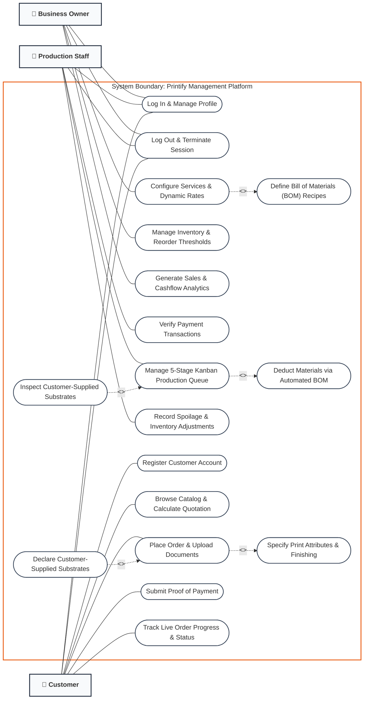

# Use Case Diagram: Printify Management System

**Project Title:** Integrated Dynamic Order, Job Scheduling, and Inventory Management System for Printing Services with Automated Replenishment  
**Diagram Type:** UML 2.5 Use Case Diagram  
**Modeling Standard:** System Boundary, Actor Associations, and Dependency Modeling (`<<include>>`, `<<extend>>`)

---

## 1. Visual Use Case Diagram (Mermaid.js)

---

## 2. Actor Characterization

| Actor | Classification | Architectural Role & System Responsibilities |
| :--- | :--- | :--- |
| **Business Owner** | Primary / Administrator | Exercises strategic administrative authority. Configures shop services, sets baseline and dynamic pricing algorithms, registers material Bill of Materials (BOM) recipes, oversees warehouse stock levels, sets safety stock thresholds, and analyzes business intelligence (sales, margins, customer volume). |
| **Production Staff** | Primary / Operator | Executes workshop floor production. Audits incoming payment receipts, manages orders across the visual 5-stage workshop Kanban board, verifies customer-provided paper stock at the counter, triggers machine processing, and logs manual inventory deductions for material spoilage or damaged goods. |
| **Customer** | Primary / End-User | Initiates revenue transactions. Creates accounts, browses available services, configures customized print job parameters with real-time price feedback, uploads artwork/documents, flags customer-supplied paper ("Dala ang Papel"), submits transaction receipts, and tracks real-time production progression through to ready-for-pickup notification. |

---

## 3. Actor-to-Use Case Traceability Matrix

| Use Case ID | Use Case Name | Business Owner | Production Staff | Customer | Relationship Dependencies |
| :---: | :--- | :---: | :---: | :---: | :--- |
| **UC-01** | Log In & Manage Profile | **X** | **X** | **X** | Base use case |
| **UC-02** | Register Customer Account | | | **X** | Base use case |
| **UC-03** | Browse Catalog & Calculate Quotation | | | **X** | Base use case |
| **UC-04** | Place Order & Upload Documents | | | **X** | Base use case |
| **UC-05** | Specify Print Attributes & Finishing | | | | `<<include>>` by UC-04 |
| **UC-06** | Declare Customer-Supplied Substrates | | | | `<<extend>>` to UC-04 |
| **UC-07** | Submit Proof of Payment | | | **X** | Base use case |
| **UC-08** | Track Live Order Progress & Status | | | **X** | Base use case |
| **UC-09** | Verify Payment Transactions | | **X** | | Base use case |
| **UC-10** | Manage 5-Stage Kanban Production Queue | | **X** | | Base use case |
| **UC-11** | Deduct Materials via Automated BOM | | | | `<<include>>` by UC-10 |
| **UC-12** | Inspect Customer-Supplied Substrates | | | | `<<extend>>` to UC-10 |
| **UC-13** | Record Spoilage & Inventory Adjustments | | **X** | | Base use case |
| **UC-14** | Configure Services & Dynamic Rates | **X** | | | Base use case |
| **UC-15** | Define Bill of Materials (BOM) Recipes | | | | `<<include>>` by UC-14 |
| **UC-16** | Manage Inventory & Reorder Thresholds | **X** | | | Base use case |
| **UC-17** | Generate Sales & Cashflow Analytics | **X** | | | Base use case |
| **UC-18** | Log Out & Terminate Session | **X** | **X** | **X** | Base use case |

---

## 4. Stereotype Justifications (`<<include>>` vs. `<<extend>>`)

1. **`Place Order` `--<<include>>-->` `Specify Print Attributes`**:
   - *Rationale:* An order cannot be instantiated without technical parameters (quantity, paper stock, color mode, dimensions). The base use case unconditionally requires this execution.
2. **`Declare Customer-Supplied Substrates` `--<<extend>>-->` `Place Order`**:
   - *Rationale:* Customers only invoke substrate declaration when exercising the "Dala ang Papel" option. This is an optional extension that modifies pricing formulas and material requirements.
3. **`Configure Services` `--<<include>>-->` `Define BOM Recipes`**:
   - *Rationale:* Every production service configured in the shop catalog must map to inventory consumables (paper sheets, toner coverage, binding elements) to enable automated stock deduction.
4. **`Manage Kanban Production Queue` `--<<include>>-->` `Deduct Materials via Automated BOM`**:
   - *Rationale:* Moving a digital job ticket into production stages programmatically decrements raw inventory items linked via the service BOM recipes.
5. **`Inspect Customer-Supplied Substrates` `--<<extend>>-->` `Manage Kanban Production Queue`**:
   - *Rationale:* Counter inspection and physical verification only occur when the incoming job ticket contains a flag indicating customer-supplied substrates.
